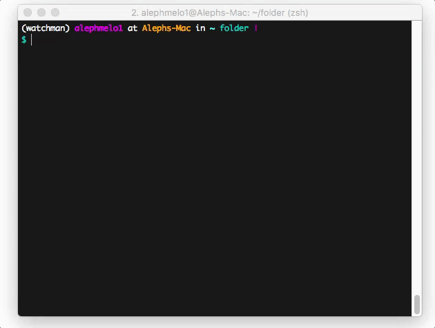

# Watchman

## Installation
```
$ pip install watchman
```

## Usage
From the directory containing all your projects (subfolders):
```
$ watchman check
project1                     is on branch: default
project2                     is on branch: default
project3                     is on branch: development

```
Note: Default scm app is mercurial, if you use git just set -s flag:
```
$ watchman check -s git
project1                     is on branch: master
project2                     is on branch: patch-1
project3                     is on branch: dev
```
## Contributing
Just clone the repo and install via Python
```
$ git clone git@github.com:alephmelo/watchman.git
$ cd watchman
$ python setup.py develop
```
## Demo

## TODO (lots of it)
- [x] Optional git or mercurial
- [ ] Set all to <name> branch (e.g. master/default)
- [x] Coloring for better UX
- [ ] Many more.
